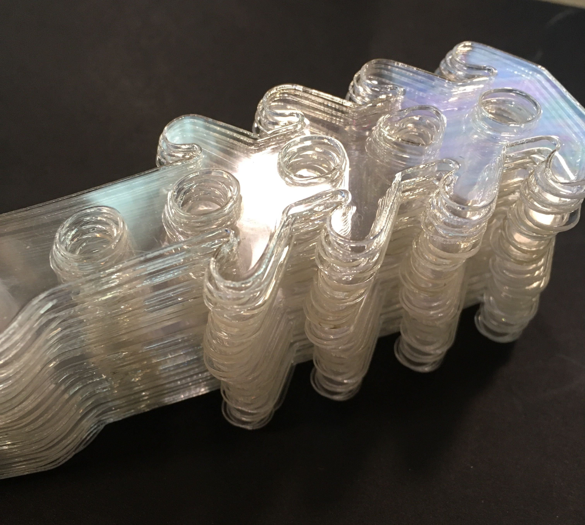

When you put on a mask you're fighting COVID-19. Everyone has been encouraged to do it in Toronto. But for some people, namely our front-line health care workers the mask rarely comes off during the day. What can be mildly annoying, namely the straps, can become downright uncomfortable.

The comfort band is the solution.

This simple but ingenious design takes the pressure away from the ears, and helps keep sufficient tension on the facemask to keep it from moving around.

Unlike the other parts we're producing, the comfort band is a 2D design. That gives us options on how to produce.

3D Printing the comfort band works well and produces a reliable part. But it takes time and can be somewhat brittle.

On the other hand, using the laser cutter produces a similar part in seconds, and allows for a wider variety of materials to be used - textiles, many plastics, etc. The one major caveat with the laser is that no material with the potential to off-gas chlorine can be used. That includes any kind of poly-vinyl carbonate (PVC). Such gasses are harmful, and very difficult to remove through exhaust scrubbing.

In the photo above you can see the laser-cut version, which is lightweight and very flexible. You can bend it in a complete circle and it won't break.

The 3D printed version has yield, but it can definitely be broken if it is flexed too hard.

Just goes to show that no single tool is perfect for everything - every method has it's up-side and down-side, and it is really about having access to a variety of methods, matching them to the use.

But whether printed or laser-cut, the comfort band is a welcome addition to the tools that make the daily routine of our health-care workers a little more bearable.
