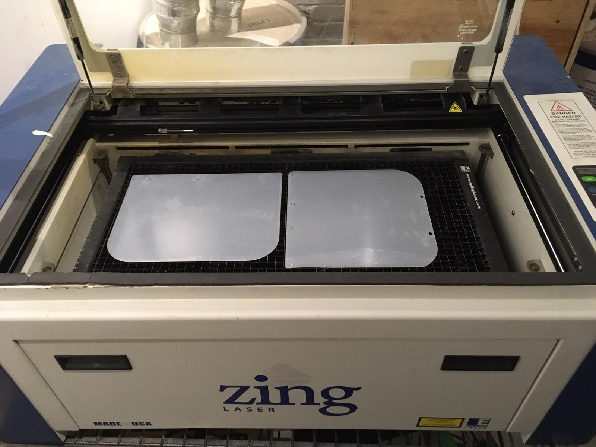
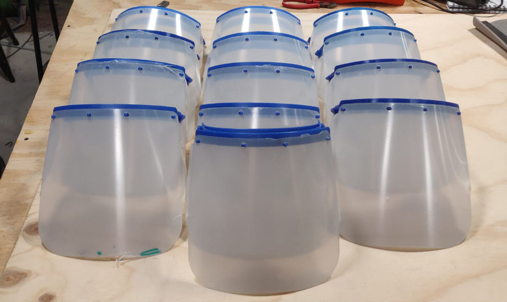

Here in Toronto, at the time of this writing we are, like most of the world, dealing with the crisis created by the COVID-19 pandemic. As the number of confirmed cases continued to grow, Prime Minister Trudeau put out a call for creative thinking to help relieve the desperate need for protective equipment for front-line health care workers.

On March 23, the Prime Minister called on Makers to get involved with the words "we're looking at innovative solutions they can be part of including 3D printing of medical supplies. Many institutions have already stepped up and many more will do the same".

The design we see here if from a prototype face-shield open-sourced by Prussa, the well-known 3D Printer company, with an acrylic shield cut to size using our Epilog laser cutter.

The Prussa design is quite good, and makes for a face-shield that is robust and excellent quality. It does have one flaw, which is longer print-times that reduce the amount of production that can be achieved. For this reason, the Makers went on to modify a Swedish design to produce a unit that can be made at twice the volume of the Prussa design.

But beyond the design challenge, the TTL Makers faced logistics challenges related to the virality of the pandemic. Strict protocols had to be put in place in order to achieve production while heeding all the restrictions effected by the public health authority, for the good of all.

### Makerspace Closed

This was the toughest of all. Our awesome TTLMakerspace, the hub of all of our activity, closed both to the public and to staff/volunteers just ahead of mandatory closures for all non-essential services. This meant we would need to adapt from our usual come-together methods.

### Staying Home

The main mandate the public has been given during this time has been to stay home in order to "flatten the curve" or manage the virus spread so that health service would not get overwhelmed. It isn't just about not getting sick, it's about not inadvertently moving the virus from place to place.

_3D Print Instructor Kyle's home may be different_

### Solutions

With closures and the stay-home mandate on the way, all the printers shipped out from the Makerspace, distributed to the homes of Makers so that they would not need to leave.

Groups communicated using online tools. In What's App, one group planned communications with local hospitals to get details of the need, protocols for sterilization of the parts, and began planning designs based on those communications. In Discord, a second groupe planned for scaling up production, communicating out to the larger community what was being done, and transportation.

Many helpful resources and suggestions came in from the community via Facebook and the list-serve.

While printing could be done at home, vital parts like the transparent face shields could only be done at the Makerspace. So we set up protocols to ensure only one person would be admitted, wearing proper protective gear.

_Epilog Zing producing face shields_

Similar protocols were put in place for retrieving parts from the various homes of makers - this was done entirely contact-free using drop points like mailboxes. Parts were bagged and tagged by where they were produced, so that if necessary they could be traced back to where they came from.

### Results

And so, with all the precautions in place parts began to ship, making their way to the care-workers that so desperately needed them. At the time of writing more than 300 face shields have shipped out. But this is far from the end of the story. Check out how we increased production, met more requests from the hospitals, and contributed to the open-source knowledge base.
